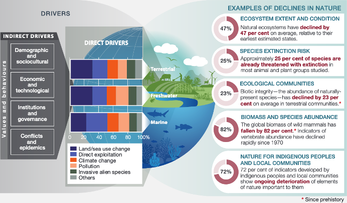

```{r setup, include=FALSE}
knitr::opts_chunk$set(echo = TRUE)
```

```{r klippy, echo=FALSE, include=TRUE}
klippy::klippy(position = c('top','right'))
```


Note: thank you to Geethen Singh for an earlier version of this practical.

### Learning objectives

1. Manipulate rasters
2. Reclassify rasters
3. Tabulate changes between rasters
4. Visualise rasters

### Introduction

With habitat loss being the major driver of global biodiversity declines, understanding the patterns and local drivers of land cover change are essential for halting and reversing these processes. The UN encourages countries to monitor land cover change to achieve several of the international targets (such as the Aichi targets and Sustainable Development Goals) put in place to sustainably manage our planet. 

Land cover and land use are two closely related, but different terms. Land cover refers to the physical land type (e.g. forest, grassland, water), whereas land use refers to how that land is used by people. Read [this paper](https://www.tandfonline.com/doi/full/10.1080/17474230802465140) to better understand this distinction.

```{r sf objects, echo=FALSE, fig.align="center", out.width='80%', fig.cap='The primary drivers of global biodiversity loss. Credit: IPBES global assessment summary report for policymakers.'}

```

In this tutorial, we will be using the South African National Land Cover datasets from 1990 and 2020 to document changes in land cover over time within the City of Johannesburg. 

### Tutorial

Let's start by loading in our libraries. We are going to primarily rely on `terra` for our spatial data tasks. `terra` is typically used for `raster` data. However, it is also very handy for using `vector` data. This is particularly the case when running functions that require both `raster` and `vector` data, because the package is optimised for using its own data structures. So, although we will use the `sf` package for visualising later, we will stick to `terra` for most of our spatial data tasks. 

```{r install and load libraries, message = FALSE, warning=FALSE}
#### Install packages ----
# install.packages('ggalluvial') 
# install.packages('patchwork')
# install.packages('mapview')

#### Load libraries ----
library(sf) # vector data
library(terra) # vector and raster data
library(tidyverse) # manipulating and visualising data 
library(ggalluvial) # to visualise changes
library(patchwork) # combine ggplots
library(mapview) # interactive maps
```

#### Load data 

We start by loading in our two raster layers, followed by the boundary for the City of Johannesburg (coj).

```{r load data}
lc1990 <- rast("data/land_cover_change/SANLC_1990_COJ_extent.tif")
lc2020 <- rast("data/land_cover_change/SANLC_2020_COJ_extent.tif")
coj <- vect("data/land_cover_change/COJ_boundary.shp")
```

Start by plotting the unprocessed data:

```{r plot raw data}
par(mfrow = c(1,3))
plot(lc1990)
plot(lc2020)
plot(coj)
```

#### Check projections

As always, we will need to check our projections to make sure the layers are in the same CRS.

```{r projections}
print(paste0("Do the layers have the same CRS? ", crs(lc1990)==crs(lc2020)))

lc1990 <- project(lc1990, lc2020)
print(paste0("Do the layers have the same CRS? ", crs(lc1990)==crs(lc2020)))

#Reproject the coj vector to match the land cover rasters
coj <- project(coj, lc2020)

# Plot maps to view our data
par(mfrow = c(1,1))
plot(lc1990)
plot(coj, add = TRUE)
```

#### Crop & Mask

Next we crop and mask our land cover rasters to the exact boundaries of the COJ. We first crop the rasters, which limits them to the exact same extent as our COJ vector layer. We then mask them to remove all pixels outside of the COJ boundary.

```{r crop and mask}
# First crop and then mask the land cover data to our area of interest
lc1990_aoi <- mask(crop(lc1990, coj), coj)
lc2020_aoi <- mask(crop(lc2020, coj), coj)
print(paste0("Do the layers have the same extent? ", ext(lc1990_aoi) == ext(lc2020_aoi)))

# Check to see if this worked
plot(lc2020_aoi)
plot(coj, add = TRUE)
```

#### Reclassify

We have more than 70 classes for each of the land cover datasets. At this point we want to reclassify these classes to simpler classes

Let's merge all of our classes into 4 broad categories:

1. Water

2. Agriculture

3. Artificial surfaces

4. Vegetation

To do this, we need to know what each land cover value is. These can be found [here](https://egis.environment.gov.za/data_egis/data_download/current) for both 1990 and 2020.

To reclassify the data, we need to create a reclassification matrix. Each line in the argument below corresponds to a lower and upper bound of values and then the value to replace it with maiking a 3-column matrix with from-to-becomes values.

```{r reclassify 1990}
# Create a reclassification matrix for 1990
m1990 <- rbind(c(0, 3, 1),
          c(36, 38, 1),
          c(9, 31, 2),
          c(34, 36, 3),
          c(38, 51, 3),
          c(52, 56, 3),
          c(60, 72, 3),
          c(3, 9, 4),
          c(31, 34, 4),
          c(51, 52, 4),
          c(56, 60, 4))

# Reclassify using the terra::classify function
lc1990_rcl <- classify(lc1990_aoi, m1990)
plot(lc1990_rcl)
```

Do the same for the 2020 land cover raster. Note that because the 1990 and 2020 rasters have different values, we need to provide a new reclassification matrix. 

```{r reclassify 2020}
# Create a reclassification matrix for 2020
m2020 <- rbind(c(13, 24, 1),
               c(31, 46, 2),
               c(24, 31, 3),
               c(46, 60, 3),
               c(64, 73, 3),
               c(0, 13, 4),
               c(13, 19, 4),
               c(19, 25, 4),
               c(60, 64, 4))

# Reclassify 2020
lc2020_rcl <- classify(lc2020_aoi, m2020)
plot(lc2020_rcl)
```

#### Cross tabulate changes

Now that we have simplified our land cover rasters, we can cross tabulate the changes between all classes. First we stack our two rasters together and then use the `terra::crosstab()` function. The output of this shows the change (and persistence) for each land cover class between our two time periods.

```{r crosstab}
# We now want to calculate the pairwise changes between the 1990 and 2020 land cover data.

# stack the land cover
landcover_stack <- c(lc2020_rcl, lc1990_rcl)
# Run a change analysis using the terra::crosstab function. long = T returns a data frame instead of a table.
lc_changes <- crosstab(landcover_stack, long = TRUE)
head(lc_changes)
```

We will now tidy this up, by providing new names for each column, calculating the area of change (each pixel is 30m2, so we multiply the changes in pixels by 900 and then divide it by 1000000 to get a value in km2), and lastly converting the integer values to sensible labels.

```{r tidy up crosstab}
# tidy up this output by changing the raster names, calculating the area of each class and assigning the full names back to the numbers
lc_changes %>% 
  rename(rcls_2020 = SANLC_2020_COJ_extent,
        rcls_1990 = SANLC_1990_COJ_extent) %>%
  mutate(area = Freq*900/1e6,
  lc1990 = case_when(
    rcls_1990 == 1 ~ 'Water',
    rcls_1990 == 2 ~ 'Agriculture',
    rcls_1990 == 3 ~ 'Artificial',
    rcls_1990 == 4 ~ 'Vegetation'),
  lc2020 = case_when(
    rcls_2020 == 1 ~ 'Water',
    rcls_2020 == 2 ~ 'Agriculture',
    rcls_2020 == 3 ~ 'Artificial',
    rcls_2020 == 4 ~ 'Vegetation')
) %>% select(lc1990, lc2020, area) -> lc_changes_labelled

lc_changes_labelled
```

#### Visualisation

We can now visualise these changes using a sankey-style diagram. 

```{r visualise, message = FALSE, warning=FALSE}
# First let's run a sankey/alluvium plot
alluv_plot <- ggplot(lc_changes_labelled, aes(axis1 = lc1990, axis2 = lc2020, y = area)) +
  geom_alluvium(aes(fill = lc1990)) +
  scale_fill_manual(values = c('#7E6148B2','#F39B7FB2','#00A087B2','#4DBBD5B2'), guide = 'none') +
  geom_stratum(fill = c('#4DBBD5B2','#00A087B2','#F39B7FB2','#7E6148B2','#4DBBD5B2','#00A087B2','#F39B7FB2','#7E6148B2'), col = NA, alpha = 0.8) +
  geom_text(stat = 'stratum', aes(label = paste(after_stat(stratum),'\n',round(after_stat(prop)*100,1))), size = 2.5) +
  scale_x_continuous(breaks = c(1, 2), labels = c('1990','2020'), position = 'top') +
  theme_void() +
  theme(axis.text.x = element_text())

alluv_plot
```

##### Aggregate & convert rasters to data frame for easier plotting

To plot rasters using ggplot, we need to convert them to a data frame. This creates a very large data frame, so just for our visualisation, we want to down sample our rasters. We do this using the `aggregate()` function, providing a factor (5) for the number of cells in each direction group. We also provide a function (modal) to summarise these cells by. 

```{r agg and convert to df}
# downsample the rasters using aggregate & convert to a data frame for plotting with ggplot2
lc1990_a <- aggregate(lc1990_rcl, 5, fun = 'modal', by = 'SANLC_1990_COJ_extent')
lc1990_df <- as.data.frame(lc1990_a, xy = TRUE)
names(lc1990_df)[3] <- 'land_cover'

lc2020_a <- aggregate(lc2020_rcl, 5, fun = 'modal', by = 'SANLC_2020_COJ_extent')
lc2020_df <- as.data.frame(lc2020_a, xy = TRUE)
names(lc2020_df)[3] <- 'land_cover'
```

Now that we have data frames for each year, we can plot them in `ggplot2`. We will use `geom_tile()` and make sure to provide both a `fill` and a `col` aesthetic. 

```{r ggplot maps}
# plot the reclassified land cover for 1990
lc1990_plot <- ggplot(lc1990_df) +
  geom_tile(aes(x = x, y = y, fill = as.factor(land_cover), col = as.factor(land_cover))) +
  scale_fill_manual(values = c('#4DBBD5B2','#7E6148B2','#F39B7FB2','#00A087B2'),labels = c('Water', 'Agriculture', 'Artificial', 'Vegetation'), guide = 'none') +
  scale_colour_manual(values = c('#4DBBD5B2','#7E6148B2','#F39B7FB2','#00A087B2'), guide = 'none') +
  geom_sf(data = st_as_sf(coj), fill = NA, col = 'black', lwd = 0.2) +
  labs(title = '1990', fill = 'Land Cover') +
  theme_void() +
  theme(plot.title = element_text(hjust = 0.5)) 
  
# plot the reclassified land cover for 2020
lc2020_plot <- ggplot(lc2020_df) +
  geom_tile(aes(x = x, y = y, fill = as.factor(land_cover))) +
  geom_tile(aes(x = x, y = y, fill = as.factor(land_cover), col = as.factor(land_cover))) +
  scale_fill_manual(values = c('#4DBBD5B2','#7E6148B2','#F39B7FB2','#00A087B2'),labels = c('Water', 'Agriculture', 'Artificial', 'Vegetation'), guide = 'none') +
  scale_colour_manual(values = c('#4DBBD5B2','#7E6148B2','#F39B7FB2','#00A087B2'), guide = 'none') +
  geom_sf(data = st_as_sf(coj), fill = NA, col = 'black', lwd = 0.2) +
  labs(title = '2020', fill = 'Land Cover') +
  theme_void() +
  theme(plot.title = element_text(hjust = 0.5)) 
```

We can then combine all of our ggplots together using the syntax from the `patchwork` library. To add ggplots together use a `+`. We can use a `&` to add on features for all plots, such as labels.

```{r patchwork all plots, message = FALSE, warning=FALSE}
# Combine the plots together using patchwork and add on plot labels
lc_plots <- lc1990_plot + lc2020_plot + alluv_plot & plot_annotation(tag_levels = 'a', tag_suffix = ')')
lc_plots
```

```{r save output, message = FALSE, warning=FALSE}
# Save the output
ggsave('output/figs/land_cover_change/land_cover_plots.png', lc_plots,
       width = 180, height = 100, units = c('mm'), dpi = 'retina')
```

#### Interactive map

Our final, bonus step is to create an interactive output. To do this, we will use the `mapview` package. This package only takes `raster` package-style rasters, so we first convert our `terra::SpatRast` to a `raster::Raster` and then convert this to a factor. We then assign our sensible labels back onto the raster for plotting. Finally, we plot the interactive map with just a few simple steps. 

```{r mapview, message = FALSE, warning=FALSE}
cls <- c('Water', 'Agriculture', 'Artificial', 'Vegetation')
lc1990_raster <- as.factor(raster::raster(lc1990_a))
lc1990_raster[] = factor(cls[lc1990_raster[]])
lc2020_raster <- as.factor(raster::raster(lc2020_a))
lc2020_raster[] = factor(cls[lc2020_raster[]])

m <- mapview(lc1990_raster, na.color = NA, layer.name = 'Land Cover 1990', alpha = 1) +
  mapview(lc2020_raster, na.color = NA, layer.name = 'Land Cover 2020', alpha = 1, legend = FALSE)
m
```

And then save this output to html, which can be easily shared our embedded in websites:

```{r save mapview}
mapshot(m, "output/figs/land_cover_change/interactive_map.html")
```

