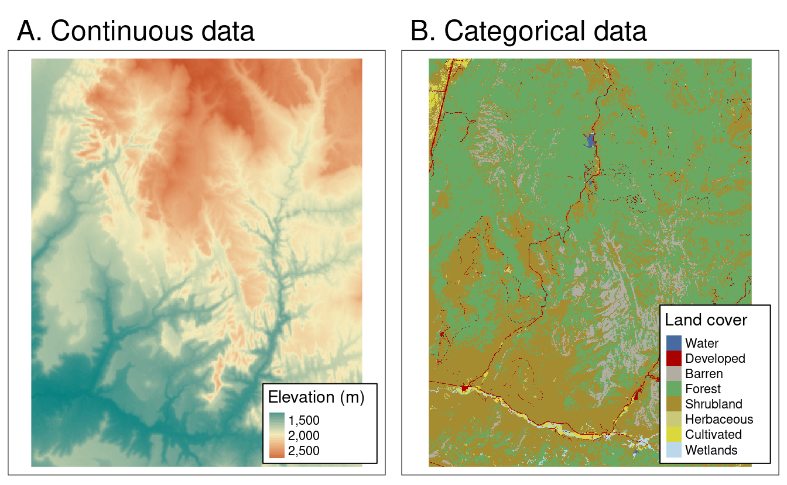

```{r setup, include=FALSE}
knitr::opts_chunk$set(echo = TRUE)
```

```{r klippy, echo=FALSE, include=TRUE}
klippy::klippy(position = c('top','right'))
```

### Learning objectives

1.  Download species locations & map layers
2.  Process spatial data
3.  Produce a publication ready map

### Introduction

For many research papers, reports or popular science articles it is increasingly valuable to provide a spatial context to your findings. Visual aids, such as maps, can be excellent communication tools when sharing your findings with colleagues or the public. It involves communication, intuition and a bit of imagination. However, if used badly, they can lose their meaning or provide straight up [disinformation](https://www.vox.com/2015/2/18/8056325/bad-maps).

To create your own maps, it is important to understand some of the core types of data that you may be using. Spatial data comes in two formats: **vectors** and **rasters**.

### Vector data

**Vectors** store information using either points, lines or polygons. You may be familiar with vectors in the format **shapefiles** (.shp), **kmz**/**kml** or **gpx**. We will mostly work with **shapefiles**. Vector files are useful for delineating boundaries, such as those for countries, protected areas. They are also often used for displaying lines or points, such as roads or species locations, respectively.

```{r sf objects, echo=FALSE, fig.align="center", out.width='60%', fig.cap='Different types of vector features supported by `sf` (or simple feature) package. Credit: Lovelace, Nowosad, Muenchow 2022: Geocomputation with R. Chapter 2'}
knitr::include_graphics("images/sf-classes.png")
```

There are several different R packages for using vector data, however in this tutorial, we will focus on the `sf` package for handling and displaying vector data. `sf` is useful for handling spatial data as the vector objects can be treated like data frames in most functions and in can be combined with the pipe operator `%>%` and works well with the `tidyverse` group of R packages. This includes integration into the `ggplot2` package, which will help us with making maps later.

### Raster data

**Rasters** represent data in a grid of 'cells', which are typically referred to as 'pixels'. Generally, these cells/pixels have a constant size or spatial resolution (e.g. mm/m/km). **Rasters** are formatted as a matrix, with rows and columns. Each **raster** will also come with a 'header' or metadata, which includes information on the coordinate reference system (which we discuss later), an extent and an origin.

The values inside each raster cell can represent either *continuous* or *categorical* data. Continuous data may include values such as temperature, elevation or spectral data. Categorical data may include land cover types or discrete categories of soil classes.

```{r raster types, echo=FALSE, fig.align="center", out.width='60%', fig.cap='Different types of raster data. Credit: Lovelace, Nowosad, Muenchow 2022: Geocomputation with R. Chapter 2'}

```

Much like vector data, there are several R packages available for handling raster data. In this course, we will focus on the `terra` package to help streamline your learning process. `terra` is the natural successor to the `raster` package. The `terra` package is faster and provides update functionality to the `raster` package.

### Coordinate Reference Systems

The last topic to introduce you to before getting coding is **Coordinate Reference System** or **CRS**. Both raster and vector data share this property. It defines our spatial objects are represented on the surface of the earth.

CRSs can be either **GEOGRAPHIC** or **PROJECTED**.

**Geographic** CRSs specify a location on the surface of the earth using **LONGITUDE** and **LATITUDE**. This means that distances are not measured in meters, as the earth is measured as 3D-surface: either a spherical or ellipsoidal surface.

**Projected** CRSs represent a projected surface of the 3D earth onto a 2D. These allow distances to be measured in meters. Every projection will have some kind of distortion. This distortion will impact the area, direction, distance or shape of the projection. This means it is important to keep in mind when doing area or distance based calculations! The best tip is to make sure that your projection matches the space that you are working in.

Watch this video to get a better visual idea of the difference between a **Geographic** and **Projected** CRS:

```{r, echo = FALSE, warning = FALSE, message = FALSE}
library(magrittr)
vembedr::embed_url("https://www.youtube.com/watch?v=kIID5FDi2JQ") %>%
  vembedr::use_align("center") %>%
  vembedr::use_bs_responsive()
```

To find a list of all available projections use this function: `sf_proj_info(type = "proj")` and more information on each one can be seen at [Geo Projections](https://www.geo-projections.com/). The webpage [thetruesize](https://thetruesize.com), is also a fun and useful tool to explore how the Mercator projection distorts areas.

### Tutorial

That covers the basics. For a fuller explanation of these basics, please visit the [Geocomputation with R](https://geocompr.robinlovelace.net/spatial-class.html#spatial-class) notebook. In this tutorial, you will become more familiar with **vector** based data for making a map of species localities. In the following tutorials, you will get some more experience in handling **raster** based data. Let's get started with coding. The first step in our coding workflow is to install and load the required packages:

```{r install and load packages, message = FALSE, warning=FALSE}
# install.packages('rgbif')
# install.packages('tidyverse')
# install.packages('CoordinateCleaner')
# install.packages('rnaturalearth')
# install.packages('sf')
# install.packages('leaflet')
# install.packages('ggspatial')
# install.packages('patchwork')

library(tidyverse)
library(rgbif)
library(CoordinateCleaner)
library(rnaturalearth)
library(sf)
library(leaflet)
library(ggspatial)
library(patchwork)

# # Alternative method to load many libraries
# if(!require("pacman")) install.packages("pacman")
# pacman::p_load(tidyverse, rgbif, CoordinateCleaner, rnaturalearth, sf, leaflet, ggspatial, patchwork)
```

#### Downloading & cleaning species data from GBIF

We will download the data from the Global Biodiversity Information Facility ([GBIF](https://www.gbif.org/)). This is a massive online database of museum, herbarium, large database and in person observations. It has recently been integrated with [iNaturalist](https://www.inaturalist.org/) (a citizen science based observation platform), meaning it has both historical and contemporary observations.

We will be working on *Protea roupelliae*. A summer rainfall *Protea* species, which occurs extensively across eastern South Africa, Lesotho and eSwatini. There are two subspecies, but we will treat these as the same thing in this tutorial.

```{r Download species data from GBIF}
# Name your species
myspecies <- c("protea roupelliae")

# download GBIF occurrence data for this species; this takes time if there are many data points!
gbif_download <- occ_data(scientificName = myspecies, hasCoordinate = TRUE, limit = 1000)

gbif_data <- gbif_download$data
names(gbif_data)[1:10]
```

The GBIF data includes many historical observations, which were taken before the use of GPS. Because of this, the locations provided may have errors, lack precision or may not be at the required spatial scale for downstream analysis. Please read [this text](https://assets.ctfassets.net/uo17ejk9rkwj/46SfGRfOesU0IagMMAOIkk/1c03ea3e21fcd9025cc800d786890e72/Principles_20and_20Methods_20of_20Data_20Cleaning_20-_20ENGLISH.pdf) for more information on why we need to clean GBIF location data.

We use the `CoordinateCleaner` package to use some useful functions that allow for easy cleaning of the locality data. Each function gives an output telling us how many observations were dropped.

```{r Clean GBIF data}
gbif_data %>%
  filter(year >= 1900) %>%
  filter(!coordinateUncertaintyInMeters %in% c(301,3036,999,9999)) %>% # known inaccurate default values
  filter(!decimalLatitude == 0 | !decimalLongitude == 0) %>%
  cc_cen(lat = 'decimalLatitude', lon = 'decimalLongitude', buffer = 2000) %>% # remove country centroids within 2km 
  cc_cap(lat = 'decimalLatitude', lon = 'decimalLongitude', buffer = 2000) %>% # remove capitals centroids within 2km
  cc_inst(lat = 'decimalLatitude', lon = 'decimalLongitude', buffer = 2000) %>% # remove zoo and herbaria within 2km 
  cc_sea(lat = 'decimalLatitude', lon = 'decimalLongitude') %>% # remove from ocean 
  distinct(decimalLongitude,decimalLatitude,speciesKey,datasetKey, .keep_all = TRUE) -> p_roup
```

#### Downloading country boundaries

Next we use the `rnaturalearth` package to download country boundaries. We start with all world countries and then plot this using `ggplot2` and use the default GDP dataset for visualisation purposes.

```{r Download map layers, fig.align="center"}
# using the maps package, download and convert the download to an sf object
world <- ne_countries(scale = 'medium', returnclass = 'sf')
names(world)

# We can easily plot the world map layer using ggplot
ggplot() +
  geom_sf(data = world, aes(fill = gdp_md_est)) + # use the fill option within the aesthetics parameter
  scale_fill_viridis_c(trans = 'log', name = 'GDP (log)') # chose a palette for the colour gradient, transform the variable and add a name for the legend
```

Importantly, to convert a 3D space (the earth as a sphere) into a 2D image, we need to 'project' the world. There are many different attempts at accurate projections, but they normally need to compromise between area, shape and distance. The projection is important to keep in mind if you are doing any area or distance calculations. Generally, you will want to use a local or regional projection for this. Read some additional resources on projections [here](https://geocompr.robinlovelace.net/reproj-geo-data.html), [here](http://companion.soep.de/Working%20with%20SOEP%20Data/Working%20with%20spatial%20data%20in%20R.html) and [here](https://michaelminn.net/tutorials/r-projections/index.html). Let's try the Lambert Azimuthal Equal-Area projection:

```{r Changing projections}
# We can also change the projection of the coordinate reference system (CRS)
ggplot() +
  geom_sf(data = world, aes(fill = gdp_md_est)) +
  scale_fill_viridis_c(trans = 'log', name = 'GDP (log)') +
  coord_sf(crs = 3035)
```

#### Refining our map & plotting our species localities

Let's move our focus back to our species map for Protea roupelliae. We now want to filter down the countries included in a country boundary dataset to only include those within our region of interest.

```{r Refining map focus, fig.align="center"}
# Create a vector of names for countries we want to use (= southern African countries) to filter to our area of focus
countries <- c('South Africa', 'Lesotho', 'Swaziland', 'Namibia', 'Botswana', 'Zimbabwe', 'Mozambique')

# Now filter down the list of all countries to only include southern African countries
world %>% filter(admin %in% countries) -> sern_a

# Plot this using geom_sf from ggplot()
ggplot() +
  geom_sf(data = sern_a) 

# This looks a bit strange, it includes Marion Island in the sub-antarctic, which is part of South Africa!
# Remove this by setting limits on the x and y axes
base_plot1 <- ggplot() + # save the output of the map to an object
  geom_sf(data = sern_a) +
  scale_x_continuous(limits = c(16, 33)) +
  scale_y_continuous(limits = c(-35, -22))
base_plot1 # print this object, we can now reuse 'base_plot1' and add to it later
```

We can now plot add our species locality points to the map! First clean up the GBIF dataset a bit further and then convert the `data.frame` to a `simple feature` or `sf` object.

```{r plot location points 1, error = TRUE, fig.show = 'hide'}
# Now we're focused in on South Africa, let's add the GBIF points to the map
# First clean the dataset by selecting only the columns we need, rename the variables
p_roup %>% select(key, year, basisOfRecord, decimalLongitude, decimalLatitude) %>% rename(lon = decimalLongitude, lat = decimalLatitude) -> pr_clean

# Now we want to convert & project our data to the correct Coordinate Reference System
pr_no_crs <- st_as_sf(pr_clean, coords = c('lon', 'lat'))
st_crs(pr_no_crs) # as we converted these directly from GPS points, there is no set CRS

# Let's try plot this
base_plot1 +
  geom_sf(data = pr_no_crs)
```

When we try to plot this we get an error... This is because we have simply used the longitude and latitude coordinates without provided a coordinate reference system (CRS). Let's provide a CRS and try again:

```{r plot location points 2, fig.align="center"}
st_crs(sern_a)$input # first see what CRS the map layers have
pr_WGS_84 <- pr_no_crs # create a new object for the points
st_crs(pr_WGS_84) = 4326 # assigning it the CRS 4326, which is short for the World Geodetic System 1984 (WGS 84), a spatial reference system. 
st_crs(pr_WGS_84)$input # check that this worked. These give different input codes. One using the proj4string and the other the EPSG code. These are essentially the same thing. 

# Let's try plot this now
base_plot1 +
  geom_sf(data = pr_WGS_84) 
```

#### Interactive maps to identify odd features

Some of these points look a bit strange. It is always good to inspect these to see if they may be an issue later. We can make a simple interactive map to explore this. We can use the `leaflet` package to make interactive maps. Let's include information on the date & type of the observation.

```{r leaflet interactive map, fig.align="center"}
# First we want to add lon and lat as variables to our sf object
pr_WGS_84$lon <- pr_clean$lon
pr_WGS_84$lat <- pr_clean$lat

leaflet(data = pr_WGS_84) %>% addTiles() %>%
  addCircleMarkers(popup = ~as.character(paste0(basisOfRecord, '; ', year, '; ', lon, '; ', lat)), radius = 2)
```

#### Making a 'good' map

You should notice when you zoom in that many points are too regularly spaced to be exact locations of species sightings; rather, such points are likely to be centroids of (relatively large) grid cells on which particular surveys were based. This is not necessarily a problem, but remember to adjust the spatial resolution of your analysis accordingly! In our case, we want to now remove these observations from our dataset. An easy way to do this is to filter by date. We will only use dates from after 1980.

```{r filter locations further}
pr_WGS_84 %>% filter(year > 1980) -> pr_1980
```

To make an appealing map, it is useful to separate the regions of interest from those that form part of the background. In our case, South Africa, Lesotho and eSwatini (which is still labeled as Swaziland in many online databases) are our regions of interest.

```{r filter countries for mapping}
# let's separate the countries with points from those without
sa_les_esw <- sern_a %>% filter(admin %in% c('South Africa', 'Lesotho', 'Swaziland'))
other_sern_a <- sern_a %>% filter(!admin %in% c('South Africa', 'Lesotho', 'Swaziland')) # use a 'negative' filter to include all other countries
```

Let's now prepare our 'finished' plot. We can now plot our regions of interest in one colour and our background regions as a different colour. We can change the transparancy and size of our species locality and we focus in the limits of our map for the x and y axes:

```{r prepare final plot 1, fig.align="center"}
ggplot() +
  geom_sf(data = other_sern_a, fill = 'gray90', lwd = 0.3) + # change the fill colour
  geom_sf(data = sa_les_esw, fill = 'white', lwd = 0.3) + # change the fill colour
  geom_sf(data = pr_1980, alpha = 0.6, size = 2) + # change the transparency and size of the points  
  scale_x_continuous(limits = c(16, 33), breaks = seq(16, 32, 4)) + # add in breaks for the labels using sequence function
  scale_y_continuous(limits = c(-35, -22), breaks = seq(-34, -22, 4)) + # add in breaks for the labels using sequence function
  xlab('Longitude') + ylab('Latitude') 
```

Next, we can add in the a scale bar and north arrow using the `ggspatial` package. We add in text using the `annotate` function and lastly, we change some elements of the overall theme and background elements, such as the ocean colour and graticule (or grid) lines to be more visually pleasing. Save as this as another base plot for later use.

```{r prepare final plot 2, fig.align="center"}
base_plot2 <- ggplot() +
  geom_sf(data = other_sern_a, fill = 'gray90', lwd = 0.3) + # change the fill colour
  geom_sf(data = sa_les_esw, fill = 'white', lwd = 0.3) + # change the fill colour
  geom_sf(data = pr_1980, alpha = 0.6, size = 2) + # change the transparency and size of the points  
  scale_x_continuous(limits = c(16, 33), breaks = seq(16, 32, 4)) + # add in breaks for the labels using sequence function
  scale_y_continuous(limits = c(-35, -22), breaks = seq(-34, -22, 4)) + # add in breaks for the labels using sequence function
  xlab('Longitude') + ylab('Latitude') + # change the x and y axes labels
  
  
  annotation_scale(location = 'br', width_hint = 0.1, style = 'ticks', tick_height = 0) + # add in a scale bar
  annotation_north_arrow(location = 'br', pad_y = unit(1, 'cm'), style = north_arrow_minimal()) + # add in a north arrow, and change around the placement and arrow style
  annotate(geom = 'text', x = 23.5, y = -30.5, label = 'SOUTH AFRICA', colour = 'black', size = 4) + # add in text for SA
  annotate(geom = 'text', x = 28.25, y = -29.5, label = 'LESOTHO', colour = 'black', size = 2.6) + # add in text for Lesotho
  annotate(geom = 'text', x = 31.45, y = -26.6, label = 'ESWATINI', colour = 'black', size = 2.6) + # add in text for eSwatini
  theme_bw() + # edit the overall theme (there are several other options)
  theme(panel.grid = element_line(color = gray(.5), linetype = 'dashed', size = 0.3),
        panel.background = element_rect(fill = '#E8F6FC')) # lastly, change the grid line parameters and change the background (ocean) colour

base_plot2
```

#### Saving the map

Within `ggplot2`, we can use the `ggsave` function to easily save figures to different formats. PDF and PNG formats are fundamentally different, in that PDFs are vector based while PNGs (or JPEGs) are pixel based. This means you do not need to specify a resolution or DPI (Dots Per Inch) for PDFs, but for pixel based outputs, you should. Save the outputs to your output folder, specifying the file type and the width and height of your plot.

```{r save the map, eval=FALSE}
# first as a pdf, specify the output directory, the object and the width & height
ggsave('output/figs/making_a_map/map.pdf', base_plot2, width = 6.68, height = 5.76)
# next as a png, specify the same parameters, but now as it is a pixel-based file type, specify the resolution
ggsave('output/figs/making_a_map/map.png', base_plot2, width = 6.68, height = 5.76, dpi = 300)
```

#### Inset map

This is a reasonable place to end, however, if your map is of a small area (luckily not our case), it can often be useful to add an inset map to show where your site/study species is relative to other known features. For this, we can produce an inset map. In our case we will produce an inset map showing where southern Africa is relative to the rest of Africa, with a box showing our plot extent.

```{r inset map, fig.align="center"}
# Let's create a box that covers our map to show where our site is.
# We will use the limits of the previous map 

# A rectangle requires 5 points to make a complete polygon, so we will create a list with 2 columns (lon & lat) and 5 rows (5 points)
pol_lon = c(16, 33)
pol_lat = c(-35, -22)
coord_df = data.frame(pol_lon, pol_lat)

# Now make the list
coord_list <- list(
  cbind(
    coord_df$pol_lon[c(1,2,2,1,1)], 
    coord_df$pol_lat[c(1,1,2,2,1)])
)

# Convert the points to an sf polygon
base_plot2_bbox <- st_polygon(coord_list, dim = 'XY')
# Add a CRS that matches our previous systems
map_bbox <- st_sfc(base_plot2_bbox, crs = 4326)

# Plot to see if this is working
ggplot() +
  geom_sf(data = world) +
  geom_sf(data = map_bbox, fill = NA, col = 'red') # use fill = NA to make the middle of the polygon transparent
```

We have identified where our site is relative to other features. Now we can produce a 'final' inset map:

```{r inset map continued, fig.align="center"}
#### Let's now zoom in our inset map and try to match some of the other features of our basemap
# Download just Africa
africa <- ne_countries(continent = 'africa', returnclass = 'sf')
other_africa <- africa %>% filter(!admin %in% c('South Africa', 'Lesotho', 'Swaziland'))

# Create the inset map
inset_map <- ggplot() +
  geom_sf(data = other_africa, fill = 'gray90', lwd = 0.2) +
  geom_sf(data = sa_les_esw, fill = 'white', lwd = 0.2) +
  geom_sf(data = map_bbox, fill = NA, col = 'black', lwd = 0.8) +
  scale_x_continuous(limits = c(-20, 50)) +
  scale_y_continuous(limits = c(40, -35)) +
  theme_void() + # this theme removes ALL axes, grids and labels 
  theme(panel.border = element_rect(colour = 'black', fill = NA),
        panel.background = element_rect(fill = '#E8F6FC')) # we then want to add a border and the background colour back in

inset_map
```

To combine our base map and inset map together, we can use the `patchwork` package. The function `inset_element()` requires that we specify where on the base map our inset map will fall.

```{r patchwork combo, fig.align="center"}
combined_maps <- base_plot2 + inset_element(inset_map, left = 0.025, bottom = 0.6, right = 0.4, top = 0.975) 
# we need to chose the positioning of the inset, assuming the plot values go from 0 to 1 for each axis.
combined_maps
```

Then we can save our final combined map:

```{r save the combo map, eval = FALSE}
# Save the output
ggsave('output/figs/making_a_map/combined_maps.png', combined_maps, width = 6.68, height = 5.76, dpi = 300)  
```

Lastly, we want to save our filtered and cleaned species locality data as a shapefile to use in our SDMs later:

```{r export the location points, eval=FALSE}
# write the P. roupelliae locations to a shapefile
write_sf(pr_1980, 'output/files/making_a_map/p_roup_gbif.shp')
```

#### Extra resources for map making

The Geocomputation with R book has lots of excellent tutorials on the theory and application of spatial data in R. For a start [here](https://geocompr.robinlovelace.net/adv-map.html) is a full tutorial showing many different approaches to making maps in R.
