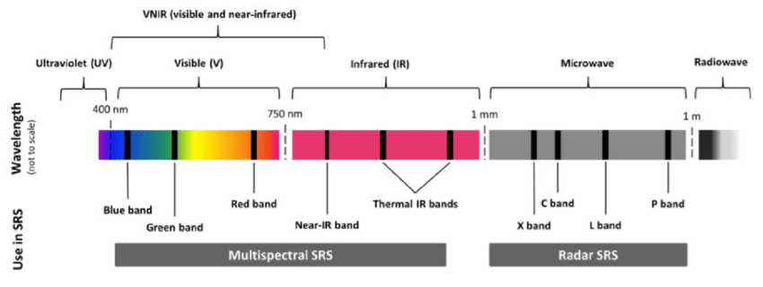

```{r setup, include=FALSE}
knitr::opts_chunk$set(echo = TRUE)
```

```{r klippy, echo=FALSE, include=TRUE}
klippy::klippy(position = c('top','right'))
```

### Learning objectives
1. Download MODIS vegetation indices
2. Process raster data
3. Produce a summarised time series

### Introduction

In this tutorial, we will delve into satellite data to better understand patterns of landscape change over space and time. So far, we have explored spatial functions, but dealing with time and dates adds another level of complexity to our analysis. To manage this, we will use several `mapping` or `looping` functions. These functions iterate a function over every element in our list or collection. This is important to learn for many elements of programming (such as in [Google Earth Engine](https://earthengine.google.com/)), but becomes extremely useful in collections of satellite data over time.

```{r raster collection, echo=FALSE, fig.align="center", out.width='60%', fig.cap='A collection of rasters over time. Source: Edzer Pebesma UseR! 2019 Spatial workshop'}
knitr::include_graphics("images/raster_by_time_edzer_UseR2019.png")
```

Satellite data can take many forms, but today we will be using passive, optical data collected from the [NASA VIIRS satellite](https://viirsland.gsfc.nasa.gov/Val/VI_Val.html). This satellite works by capturing electromagnetic information reflected from the surface of the earth using sensors. Depending on the sensitivity of the satellite (i.e. the spectral resolution), this information may be captured along different spectral **bands**. Some of these we are familiar with, such as the Red, Green or Blue band. When combining these bands together, they form a 'true' colour image. They also collect spectral information along longer wavelengths, in the infrared range. A band of particular importance to understanding vegetation dynamics is the near-infrared band.

```{r EM spectrum, echo=FALSE, fig.align="center", out.width='60%', fig.cap='The electromagnetic spectrum, highlighting typical bands used in satellite remote sensing.'}

```

### NDVI

There are certain properties of plants that make these bands useful to us. For example, healthy vegetation reflects more near-infrared (NIR) and green light, but absorbs more red and blue light. This is largely why healthy vegetation looks green to our eyes. Vegetation that is stressed or unhealthy will typically absorb more NIR and reflect more red light, in turn producing different colours, which our eyes may interpret as yellow or brown. 

```{r NDVI visual, echo=FALSE, fig.align="center", out.width='60%', fig.cap='The relationship between NIR and red bands for healthy (left) and unhealthy (right) vegetation. Source: NASA'}
knitr::include_graphics("images/ndvi_example.jpg")
```

The Normalized Difference Vegetation Index uses the NIR and red bands to formulate this relationship:
$$
NDVI = \frac{(NIR - red)}{(NIR + red)}
$$
NDVI can provide valuable information on phenology, vegetation productivity, agriculture, or disturbancs such as deforestation, illegal ploughing or wild fires.

```{r NDVI gif over SA, echo=FALSE, fig.align="center", out.width='60%', fig.cap='NDVI change over South Africa across a single year'}
knitr::include_graphics("images/sa_modis.gif")
```

There are many other indices out there for vegetation, water, fire scars and many more. For most satellites, we will need to calculate these indices ourselves. Fortunately, there are also products, such as the MODIS vegetation images, which provide these indices for us. We will use these in our practical. 

### Tutorial

Let's start coding. First install and load packages:

```{r install and load packages, message=FALSE, warning=FALSE}
# install.packages('MODISTools')
# install.packages('tidyverse')
# install.packages('terra')
# install.packages('lubridate')

#### Load packages ----
library(MODISTools) # downloading modis data
library(tidyverse) # data manipulation and plotting
library(terra) # raster manipulation
library(lubridate) # dates
```

#### Explore the data

Using the `MODISTools` package, we have direct access to all of the Moderate Resolution Imaging Spectroradiometer (MODIS) and other (e.g. VIIRS) satellite imagery. This satellite collects data on the atmosphere, land and ocean. Read up more on the land mission [here](https://modis-land.gsfc.nasa.gov/).

We will first load in our area of interest, which is the municipal boundary for the City of Johannesburg.

```{r}
#### Load in our area of interest for later----
coj <- vect("data/land_cover_change/COJ_boundary.shp")
```

Then we will identify all of the products available through `MODISTools`. We will then select the VIIRS product for vegetation indices and explore the available bands. This product gives both Normalized Difference Vegetation Index (NDVI) and Enhanced Vegetation Index (EVI) every 16 days across the globe at a spatial scale of 500m. Additionally, it provides RGB bands and information on the pixel reliability, which we will both use. 

There are products that produce a finer temporal and spatial resolution, which may suit a study working within a smaller area, but we will not require this here.

```{r Explore the MODIS data}
#### Explore modis products ----
# All products available
products <- mt_products()
head(products)

# bands of the vegetation indices product
bands <- mt_bands(product = "VNP13A1")
head(bands)
```

We can then explore all of the available dates for a location of interest - in this case a central point in Johannesburg.

```{r}
# dates available for a specific coordinate
dates <- mt_dates(product = "VNP13A1", lat = -26.2041, lon = 28.0473)
head(dates)
```

#### Downloading MODIS data

We will now set up the parameters for downloading the vegetation index (VI) data. This requires the product of interest (VIIRS Vegetation Index product), latitude and longitude (Johannesburg) and a start and end date (all of 2021). We can also specify which bands we want, which will make our download faster. Here we take the NDVI band and a pixel reliability band. 

We can also specify an area around the coordinate to download data from. Here we specify 25km left and right (`km_lr`) and 40km above and below (`km_ab`).

```{r Set up parameters for downloading satellite data}
#### Download NDVI data for JHB ----
start_time <- Sys.time()
jhb_ndvi <- mt_subset(product = "VNP13A1",
                          lat = -26.183483,
                          lon =  27.975311,
                          band = c("500_m_16_days_NDVI",
                                   "500_m_16_days_pixel_reliability"),
                          start = "2021-01-01",
                          end = "2021-12-30",
                          km_lr = 25,
                          km_ab = 40,
                          site_name = "JHB",
                          internal = TRUE,
                          progress = TRUE)
end_time <- Sys.time()
# How long does it take to download 200 km2 of VIIRS NDVI data at 500 m resolution for 2 bands?
end_time - start_time
```

Impressively, this only took 1.5 minutes to download 46 images overe 200 km2. An interesting feature of the `MODISTools` package, is that it downloads data as a `data.frame`. This makes it easy to manipulate and immediately visualise using data wrangling tools in the `tidyverse`. It is still a big data frame (~1.5 million rows) - so let's filter and summarise it down a bit.

#### Plot time series

Our aim is to produce a single median NDVI value for each unique date and plot it. Importantly, we need to rescale the NDVI data using the value in the `scale` column.

```{r summarise data}
# Summarise
jhb_ndvi %>% 
  filter(band == "500_m_16_days_NDVI") %>%
  group_by(calendar_date) %>%
  summarise(doy = yday(as_date(calendar_date)),
            ndvi_median = median(value * as.numeric(scale))) %>% 
  distinct(doy, .keep_all = TRUE) -> jhb_med_ndvi
head(jhb_med_ndvi)

# Plot
ggplot(jhb_med_ndvi, aes(x = doy, y = ndvi_median)) +
  geom_point() +
  geom_smooth(method = 'loess') +
  labs(x = 'Day of Year', y = 'NDVI (median)') +
  theme_classic() 
```

In very few lines of code - we already have a time series plot! Let's save it:

```{r}
# Save plot
ggsave('output/figs/ndvi_time_series/jhb_med_ndvi.png',
       width = 120, height = 80, units = c('mm'), dpi = 'retina', bg = 'white')
```

You may notice that in February there is a very odd, outlying observation. Let's convert the data frame to rasters to explore this a bit further.

#### Convert NDVI data frame to rasters


```{r}
# filter to NDVI and then split the data frame into a list by date
jhb_ndvi_split <- jhb_ndvi %>% filter(band == "500_m_16_days_NDVI") %>% split(jhb_ndvi$calendar_date)
```


<!-- #### Process MODIS data -->

<!-- We can now load the MODIS data into R and begin exploring the data locally and start with processing.  -->

<!-- ```{r} -->
<!-- #### Load in and process MODIS data -->
<!-- modis_files <- list.files('data/') -->
<!-- modis_files -->

<!-- # Let's use one raster image to explore the data -->
<!-- r1 <- rast(paste0('data/',modis_files[1])) -->
<!-- r1 -->

<!-- # Image properties -->
<!-- crs(r1) # CRS -->
<!-- res(r1) # resolution -->
<!-- nlyr(r1) # number of layers -->
<!-- names(r1) # names of layers -->

<!-- # We can also change the resolution, by aggregating cells. This is useful for later -->
<!-- r1_agg <- aggregate(r1, fact = 5, fun = 'mean') -->
<!-- res(r1_agg) -->

<!-- #### Plot an image -->
<!-- plot(r1[[1]]) -->
<!-- plot(r1_agg[[1]]) # plot the first layer -->
<!-- plot(r1_agg[[1]]/100000000) # plot with a scale factor -->
<!-- ``` -->

<!-- From **gisgeography**: "Normalized Difference Vegetation Index (NDVI) quantifies vegetation by measuring the difference between near-infrared (which vegetation strongly reflects) and red light (which vegetation absorbs)." -->

<!-- NDVI can only fall between -1 and 1. A simplified understanding of NDVI values may say: values greater than 0.6 may indicate healthy vegetation, values lower than 0.6 but greater than 0, may indicate unhealthy vegetation. Values below 0 are likely to be water. Read up more on NDVI at [**gisgeography**](https://gisgeography.com/ndvi-normalized-difference-vegetation-index/), where they explain the calculation and the use of different satellite bands.  -->

<!-- #### Processing MODIS data -->

<!-- We have multiple images for the same date over different regions as shown below. So we need to 'mosaic' these together. Many of the following 'for loops' are only required because we have several images. If you only have one image, many of these steps will not be required.  -->

<!-- ```{r} -->
<!-- r2 <- rast(paste0('data/',modis_files[2])) -->
<!-- par(mfrow=c(1,2)) -->
<!-- plot(r1[[1]]) -->
<!-- plot(r2[[1]]) -->
<!-- ``` -->

<!-- First, we will collect acquisition dates from file names. They are stored as yyyyddd, meaning the year and the julian day the image was collected. We want to extract the year and julian day, i.e. characters 10 to 13 and characters 14 to 16. -->

<!-- ```{r} -->
<!-- modis_files[1] -->
<!-- substr(modis_files[1], 14, 16) # for example, the first image was taken on the 353rd day of the year -->
<!-- substr(modis_files[1], 10, 13) # we also need to extract the year -->

<!-- my_dates_vector <- vector() -->
<!-- for(i in 1:length(modis_files)){ -->

<!--   jday <- substr(modis_files[i], 14, 16) -->
<!--   year <- substr(modis_files[i], 10, 13) -->
<!--   # need to convert this to a date -->
<!--   date <- ifelse(year < 2021,  -->
<!--        as.character(as.Date(as.numeric(jday), origin = '2020-01-01')), -->
<!--        as.character(as.Date(as.numeric(jday), origin = '2021-01-01'))) -->

<!--   my_dates_vector[i] <- date -->
<!-- } -->
<!-- my_dates_vector -->
<!-- ``` -->

<!-- Now that we have the dates, we can load all of the MODIS images into our local environment as a list. We will also change the spatial resolution of each image as we load it into the list: -->

<!-- ```{r} -->
<!-- #### Load in all rasters as a list and change resolution -->
<!-- my_raster_list <- list() -->
<!-- for(i in 1:length(modis_files)){ -->
<!--   r <- rast(paste0('data/',modis_files[i])) -->
<!--   names(r)[1] <- 'NDVI' -->
<!--   my_raster_list[[i]] <- aggregate(r, fact = 5, fun = 'mean') -->
<!-- } -->
<!-- length(my_raster_list) -->
<!-- ``` -->

<!-- We can now `mosaic` the rasters together. This function basically stitches the different rasters together. We run this over a grouping loop that uses the unique date of each image to identify which rasters belong together: -->

<!-- ```{r} -->
<!-- my_dates_vector_unique <- unique(my_dates_vector) -->
<!-- my_mosaic_list <- list() -->

<!-- for(i in 1:length(my_dates_vector_unique)){ -->
<!--   index <- which(my_dates_vector %in% my_dates_vector_unique[i]) -->
<!--     rlist_temp <- my_raster_list[index] -->
<!--     spat_rast_coll <- sprc(rlist_temp) -->
<!--     my_mosaic_list[[i]] <- mosaic(spat_rast_coll) -->
<!-- } -->
<!-- length(my_mosaic_list) -->
<!-- ``` -->

<!-- We now have 5 unique images, which we can plot out: -->

<!-- ```{r} -->
<!-- # Plot new mosaiced rasters -->
<!-- par(mfrow = c(3,2)) -->
<!-- plot(my_mosaic_list[[1]]$NDVI); title(my_dates_vector_unique[1]) -->
<!-- plot(my_mosaic_list[[2]]$NDVI); title(my_dates_vector_unique[2]) -->
<!-- plot(my_mosaic_list[[3]]$NDVI); title(my_dates_vector_unique[3]) -->
<!-- plot(my_mosaic_list[[4]]$NDVI); title(my_dates_vector_unique[4]) -->
<!-- plot(my_mosaic_list[[5]]$NDVI); title(my_dates_vector_unique[5]) -->
<!-- ``` -->

<!-- Next, we re-project the data to a format we're familiar with and that links to our *Protea* location data: -->

<!-- ```{r} -->
<!-- crs <- "+proj=longlat +datum=WGS84" -->
<!-- my_mosaic_list_reproj <- lapply(my_mosaic_list, function(x) project(x, crs)) -->

<!-- par(mfrow=c(1,1)) -->
<!-- plot(my_mosaic_list_reproj[[1]]$NDVI) -->
<!-- points(as_Spatial(p_roup)) -->
<!-- ``` -->

<!-- Lastly, we can discard the bands we do not need and only keep the NDVI band. At the same time, we will scale the NDVI values to fall between -1 and 1: -->

<!-- ```{r} -->
<!-- my_mosaic_list_scale <- lapply(my_mosaic_list_reproj, function(x) x$NDVI/100000000) -->
<!-- par(mfrow=c(2,1)) -->
<!-- plot(my_mosaic_list[[5]]$NDVI); points(as_Spatial(p_roup)) -->
<!-- plot(my_mosaic_list_scale[[1]]); points(as_Spatial(p_roup)) -->
<!-- ``` -->

<!-- #### Extract NDVI values for each *Protea* location -->

<!-- We now want to extract NDVI values for each *Protea* location across each time interval. To do this, we use `terra::extract`, which requires a raster and vector file. We run the `lapply` function, which is another type of `loop` function. It is designed to run over a list.  -->

<!-- Once the dataset is extract, we change the name of each column to each date and then 'pivot' or transform our dataframe to a long format. We can then easily calculate summary statistics, such as mean, standard deviation and standard error of NDVI across all *Proteas*. -->

<!-- ```{r} -->
<!-- pr_ndvi_list <- lapply(my_mosaic_list_scale, function(x) terra::extract(x, st_coordinates(p_roup))) -->
<!-- pr_ndvi_df <- data.frame(pr_ndvi_list) -->
<!-- names(pr_ndvi_df) <- my_dates_vector_unique -->
<!-- pr_ndvi_df$lon <- st_coordinates(p_roup)[,1] -->
<!-- pr_ndvi_df$lat <- st_coordinates(p_roup)[,2] -->
<!-- head(pr_ndvi_df) -->

<!-- # Pivot to long form dataframe -->
<!-- pr_ndvi_long <- pr_ndvi_df %>% pivot_longer(cols = 1:5, names_to = 'date', values_to = 'ndvi') -->

<!-- # Summarise NDVI values for each date across P.r. locations -->
<!-- ndvi_summary <- pr_ndvi_long %>% group_by(date) %>% summarise(mean = mean(ndvi), -->
<!--                                               sd = sd(ndvi), -->
<!--                                               se = sd(ndvi)/sqrt(n())) -->
<!-- ``` -->

<!-- We now plot a time series of NDVI values across all *Proteas*.  -->

<!-- ```{r} -->
<!-- ggplot(data = ndvi_summary) + -->
<!--   geom_line(aes(x = as.Date(date), y = mean)) -->
<!-- ``` -->

<!-- This plot looks odd! But recognise that the y-axis is very truncated. We can change the parameters, which show that there is a general increase or stable NDVI change over the ~2 months we are focusing on. -->

<!-- ```{r} -->
<!-- ggplot(data = ndvi_summary) + -->
<!--   geom_ribbon(aes(x = as.Date(date), y = mean, ymin = mean - sd, ymax = mean + sd), alpha = 0.3) + -->
<!--   geom_line(aes(x = as.Date(date), y = mean)) + -->
<!--   geom_point(aes(x = as.Date(date), y = mean)) + -->
<!--   scale_x_date(labels = scales::date_format("%d-%m-%Y"), limits = c(as.Date('2020-12-15'), as.Date('2021-02-20'))) + -->
<!--   scale_y_continuous(limits = c(0,1)) + -->
<!--   xlab('Date') + ylab('NDVI') + -->
<!--   theme_classic() -->
<!-- ``` -->

<!-- For comparison, we can also calculate the summary statistics and plot the time-series of NDVI values across full region (i.e. over each raster cell rather than each *Protea* location) for each unique date. -->

<!-- ```{r} -->
<!-- my_cellstats_list <- list() -->

<!-- for(i in 1:length(my_mosaic_list_scale)){ -->
<!-- mean <- global(my_mosaic_list_scale[[i]], 'mean', na.rm = TRUE) -->
<!-- sd <- global(my_mosaic_list_scale[[i]], 'sd', na.rm = TRUE) -->
<!-- se <- sd/sqrt(ncell(my_mosaic_list_scale[[i]])) -->
<!-- my_cellstats_list[[i]] <- data.frame(i,mean, sd, se) -->
<!-- } -->

<!-- cell_summary <- bind_rows(my_cellstats_list) -->
<!-- cell_summary$date <- my_dates_vector_unique -->
<!-- ``` -->

<!-- Now plot these values with the same plot specifications as the previous plot, so they are easily comparable.  -->

<!-- ```{r} -->
<!-- ggplot(data = cell_summary) + -->
<!--   geom_ribbon(aes(x = as.Date(date), y = mean, ymin = mean - sd, ymax = mean + sd), alpha = 0.3) + -->
<!--   geom_line(aes(x = as.Date(date), y = mean)) + -->
<!--   geom_point(aes(x = as.Date(date), y = mean)) + -->
<!--   scale_x_date(labels = scales::date_format("%d-%m-%Y"), limits = c(as.Date('2020-12-15'), as.Date('2021-02-20'))) + -->
<!--   scale_y_continuous(limits = c(0,1)) + -->
<!--   xlab('Date') + ylab('NDVI') + -->
<!--   theme_classic() -->
<!-- ``` -->

<!-- What is the difference in the NDVI trend between the *Proteas* and between the background values? -->

<!-- #### Animate NDVI map -->

<!-- For presentations, it is often valuable to animate time series data. We can do this using a few different approaches, but here we will use `gganimate`, which links nicely with the `ggplot2` package. -->

<!-- First, we need a little bit more processing of the raster layers. We select the countries we are interested in and then we use the `mask` function to remove all cells in our rasters that fall outside of these countries. Plot the output to see if this worked: -->

<!-- ```{r} -->
<!-- sern_a <- ne_countries(country = c('South Africa','Lesotho','Swaziland'), returnclass = 'sf', scale = 'medium') -->
<!-- st_crs(sern_a) -->

<!-- # mask the layer by sern African countries -->
<!-- my_rast_crop <- lapply(my_mosaic_list_scale, function(x) mask(x, vect(sern_a))) -->
<!-- par(mfrow=c(1,1)) -->
<!-- plot(my_rast_crop[[1]]); points(as_Spatial(p_roup)) -->
<!-- plot(as_Spatial(sern_a), add = TRUE) -->
<!-- ``` -->

<!-- As this practical has somewhat turned into a lesson on loops, here is another application using the `purrr` package. The function `map` in the `purrr` package applies a function to each element of the list. In this case, we want to use the `map_dfr` function, which returns a data frame and binds all successive elements onto the data frame.  -->

<!-- The function we want to apply to each element within the `my_rast_crop` list is `as.data.frame()`. This converts our raster into a data frame. We wrap this function in the `setNames()` function, so that we can specify our new column names as x, y and NDVI for our value column. Lastly, we add on a unique ID for each raster, which we label `Date`. We can then use the ID column to assign the correct date to each image in our long format data frame.  -->

<!-- ```{r} -->
<!-- # Convert the rasters to a long format dataframe and give each raster a unique ID -->
<!-- mydf <- purrr::map_dfr( -->
<!--   my_rast_crop,  -->
<!--   ~setNames(as.data.frame(., xy = TRUE), c('x', 'y','NDVI')),  -->
<!--   .id = 'Date' -->
<!-- ) -->

<!-- # Convert this ID to the date of the raster -->
<!-- mydf <- mydf %>% mutate(Date = as.Date(case_when( -->
<!--   Date == 1 ~ my_dates_vector_unique[1], -->
<!--   Date == 2 ~ my_dates_vector_unique[2], -->
<!--   Date == 3 ~ my_dates_vector_unique[3], -->
<!--   Date == 4 ~ my_dates_vector_unique[4], -->
<!--   Date == 5 ~ my_dates_vector_unique[5], -->
<!-- ))) -->
<!-- ``` -->

<!-- We are now ready to set up our animation. Create a base ggplot and plot the raster using `geom_tile`. Specify your x and y coordinates and use NDVI as the 'fill' option. For context, we add in our southern African countries and *Protea* locations as simple features using `geom_sf`. -->

<!-- ```{r} -->
<!-- # Create a base ggplot -->
<!-- gg_base <- ggplot() + -->
<!--   geom_tile(data = mydf, aes(x = x, y = y, fill = NDVI)) + -->
<!--   scale_fill_gradient2(low = '#c4b68c', mid = '#628c2c', high = '#000f0f', midpoint = 0.4, breaks = c(-0.25, 0, 0.25, 0.5, 0.75, 1), limits = c(-0.25, 1), name = 'NDVI') + -->
<!--   geom_sf(data = sern_a, fill = NA, col = 'black', lwd = 0.2) + -->
<!--   geom_sf(data = p_roup, pch = 1, cex = 0.2, col = 'white') + -->
<!--   scale_x_continuous(limits = c(22, 33)) + -->
<!--   scale_y_continuous(limits = c(-34.5, -22)) + -->
<!--   xlab('Longitude') + ylab('Latitude') + -->
<!--   coord_sf() + -->
<!--   theme_minimal() -->
<!-- ``` -->

<!-- To animate this plot, we add on the function `transition_states` from the `gganimate` package. This function requires the variable that we want to change (i.e. **Date**). We then specify how long we want the transition between frames to take, and how long the animation should stay on each frame (state_length). Using the `labs(title = '')` argument, we can also provide a title to each frame. Here we use `{closest_state}`, which means it will display the **Date** of the closest frame. -->

<!-- ```{r} -->
<!-- # Now add in the transitions -->
<!-- gg_base + transition_states(states = Date, transition_length = 0.01, state_length = 1) + labs(title = "Date: {closest_state}") -->
<!-- # Date is the variable we want to change per frame; transition_length is the time between each frame; state_length is the time that the animation stays on the frame -->
<!-- # The title label is then set to 'closest_state', which reflects the closest date to each transition. -->
<!-- ``` -->

<!-- Lastly, we save this animation to file using the `anim_save` function. -->

<!-- ```{r, eval=FALSE} -->
<!-- anim_save('output/ndvi_animation.gif') # lastly, we save this as a gif. -->
<!-- ``` -->

<!-- #### Export summarised NDVI raster -->

<!-- For your next practical, you will be collecting different environmental variables to describe the habitat conditions most important to *Protea roupelliae* using species distribution models. NDVI is frequently used in these models. Let's export a summarised NDVI layer for later use. First convert our list of rasters into a single raster with several layers (or a raster collection). Then calculate the mean value for each pixel across each layer. -->

<!-- ```{r} -->
<!-- # Find mean value across each raster -->
<!-- spat_rast_coll <- rast(my_rast_crop) # convert the list to a single raster with many layers -->
<!-- mean_ndvi <- mean(spat_rast_coll, na.rm = TRUE) # calculate the mean across each layer -->
<!-- plot(mean_ndvi) -->
<!-- ``` -->

<!-- Our final step is to save this summary raster to file: -->

<!-- ```{r, eval=FALSE} -->
<!-- writeRaster(mean_ndvi, 'output/mean_ndvi.tiff') # save the raster to your output folder -->
<!-- ``` -->

#### Extra resources for using NDVI in R

The [`terra` chapter](https://rspatial.org/terra/modis/index.html) in the [rspatial book](https://rspatial.org/) has lots of excellent tutorials on the theory and application of the `terra` package in R. 