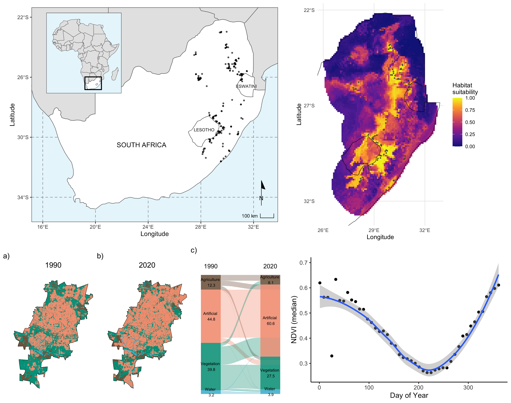

Note: the slides and video recordings will be added to the site once available.

```{r out.width='100%', echo = FALSE}

```

### Introduction

This short workshop for SAEON GSN will introduce you to spatial data and analysis in R. It is aimed at R beginners to intermediates, who may or may not have GIS-type background in other programming platforms. Use this website together with the [slides]() and [video recordings](). We will explore different types of spatial data and introduce you to spatial anaylses workflows through worked examples. These worked examples will include:

1. Making a map

2. NDVI time series

3. Land cover change

4. Species distribution models

If you have not used R before, I highly recommend going over the content provided in the [Basics of R workshop](https://jdmwhite.github.io/R_Workshop/) previously run with the SAEON GSN. Basic instructions on downloading R and R Studio can be found below.

### Getting started

#### R Studio run locally on your computer

* Step 1: Download R: https://cran.r-project.org/ (select the correct operating system for your computer)

* Step 2: Download R Studio: https://www.rstudio.com/products/rstudio/download/#download (select the correct operating system for your computer)

Once you have download and installed both, all you need is to open R Studio. The next step is to go to https://github.com/jdmwhite/Intro_to_Spatial, click **"Code"** in the top right corner and the click **"Download ZIP"**. Unzip this file, by double-clicking on it, and then open the `Intro_to_Spatial.Rproj` file. Make sure to open the file with the `.Rproj` file extension. This will automatically open R Studio and begin your session. Once it has opened, open the **scripts** folder and then click on any `.R` file. You can now run the code, either using (CONTROL + ENTER/CMD + ENTER) or click the **Run** button in the top middle of your screen.

#### R Studio Cloud

Go to [R Studio Cloud](https://rstudio.cloud/). Either **Sign Up** or as you have already run a practical here before, **Log In** to your account. Once you have logged in, click on **New Project** in the top right corner. Select **New Project from Git Repository**. Copy and paste this link into the open space: 

https://github.com/jdmwhite/Intro_to_Spatial

Wait for the project to deploy (this may take a couple of minutes). Once it has opened, open the **scripts** folder and then click on any `.R` file to explore the code. You can now run the code, either using (CONTROL + ENTER/CMD + ENTER) or click the **Run** button in the top middle of your screen. Make sure to **LOG OUT** of your R Studio Cloud session when you are finished using the platform. You are granted 25 free hours per month. But these hours will be depleted quickly if you don't log out!

### Additional Resources

See the [Additional Resources](https://jdmwhite.github.io/Intro_to_Spatial/Resources.html) page for lots of helpful links related to R.

```{r out.width='20%', echo = FALSE}

```

This course was hosted and organised by the SAEON Graduate Student Network.